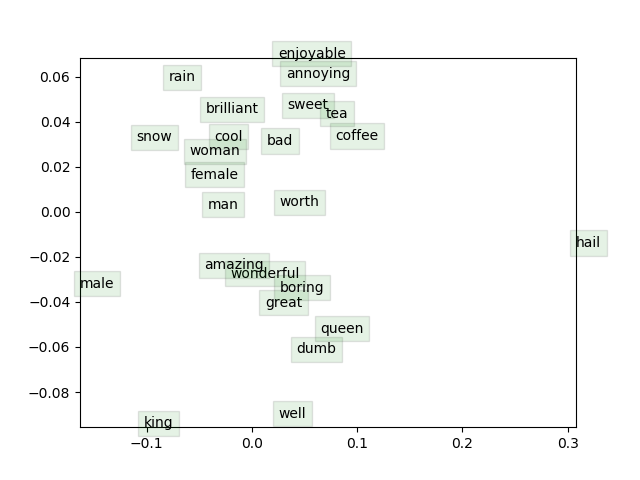

# Word2Vec-Skipgram-Model-SGD
In this project, we implement Word2vec model using the skipgram algorithm. Stochastic gradient descent (SGD) is used to train the word vectors. 


We use the below negative sampling loss function instead of the usual naive softmax to achieve efficiency in training. In the below equation, \sigma corresponds to the sigmoid function 


Below is a word2vec word embedding plot of few hand-picked words which have been dimensionally reduced to 2-dimensions




- To train word2vec and generate files *sampleVectors.json* and *word_vectors.png*
```
python run.py
```